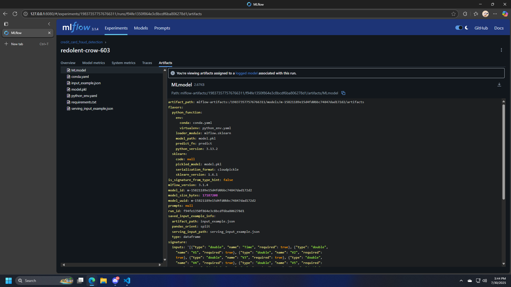

# Fraud Detection MLOps Project

This project covers several key tasks in machine learning operations (MLOps):

1. **Model Exploration & Analysis:**  
   - Learn to explore and analyze models, especially handling unbalanced data.
2. **Model Training & Logging:**  
   - Train models and log all results using MLflow.
3. **Model Serving:**  
   - Build a simple FastAPI service to serve the trained model.
4. **Kafka Integration:**  
   - Use Docker to set up Kafka and Zookeeper.
   - Create producer and consumer scripts to simulate real-world data streaming.
5. **Model Retraining:**  
   - Implement a script for retraining the model.
6. **Containerization & Orchestration:**  
   - Dockerize the FastAPI service, producer, and consumer.
   - Deploy everything to Kubernetes using Minikube and Helm.

---

## Dataset

- The dataset is from [Kaggle: Credit Card Fraud Detection](https://www.kaggle.com/datasets/mlg-ulb/creditcardfraud).
- Download the dataset and, rename to `creditcard.csv` and place it in the `data/` directory.
- Inside `notebooks/eda.ipynb`, contain a script for separating the dataset into training and testing sets. Run that script to create `data/train.csv` and `data/test.csv`.
- The training dataset is used to train the model and log results via MLflow.
- The testing dataset is used to evaluate model performance.
- The producer uses `data/test.csv` to send random records to the Kafka topic.
- The consumer reads from the Kafka topic, sends data to FastAPI for predictions, and writes the results to `data/prediction.csv`.

---

## How to Run the Project

### 0. Train the model and log results
- Ensure you have Python and the required packages installed. You can install the dependencies using:
```bash
pip install -r requirements.txt
```
- Run the Jupyter notebook `notebooks/eda.ipynb` to explore the dataset
- Run this to train the model and log results using [MLflow](https://mlflow.org/).
```bash
python models/train.py
```
- You can view the logged results in the MLflow UI by running:
```bash
mlflow server --host 127.0.0.1 --port 8080
```
Example: 
 
### 1. Start Minikube
[Minikube](https://minikube.sigs.k8s.io/docs/start/) is a tool that makes it easy to run Kubernetes locally. Follow the instructions on the Minikube website to install and start it.

```bash
minikube start
```
### 2. Start Kafka (and Zookeeper) using Helm
[Helm](https://helm.sh/docs/intro/install/) is a package manager for Kubernetes. For this project, we will use the Bitnami Kafka chart to deploy Kafka and Zookeeper.  
Run the following commands to install Kafka via Helm:

```bash
helm repo add bitnami https://charts.bitnami.com/bitnami
helm repo update

helm install kafka-release bitnami/kafka
```

### 3. Deploy the FastAPI Service

- The FastAPI service handles predictions and returns results.
- Build the Docker image:
```bash
  docker build -t fraud-api -f api/Dockerfile .
  ```
- Deploy the service:
```bash
  kubectl apply -f k3s/fraud-api-deployment.yaml
  ```
- The service will be available as **fraud-api-service**.
- To access it via a local port, add `nodePort: 30080` to the service definition in `k3s/fraud-api-service.yaml`.

### 4. Deploy the Kafka Producer and Consumer

- Build and deploy the producer:
```bash
  docker build -t kafka-producer -f kafka/producer/Dockerfile .
  kubectl apply -f k3s/kafka-producer-deployment.yaml
  ```
- Build and deploy the consumer:
```bash
  docker build -t kafka-consumer -f kafka/consumer/Dockerfile .
  kubectl apply -f k3s/kafka-consumer-deployment.yaml
  ```
- The producer sends messages to the `fraud-data` topic.
- The consumer reads from the same topic and sends data to the FastAPI service for predictions.
- **Note:** Set the environment variable `KAFKA_BOOTSTRAP_SERVERS` to the Kafka service address, e.g., `kafka-release:9092`.


